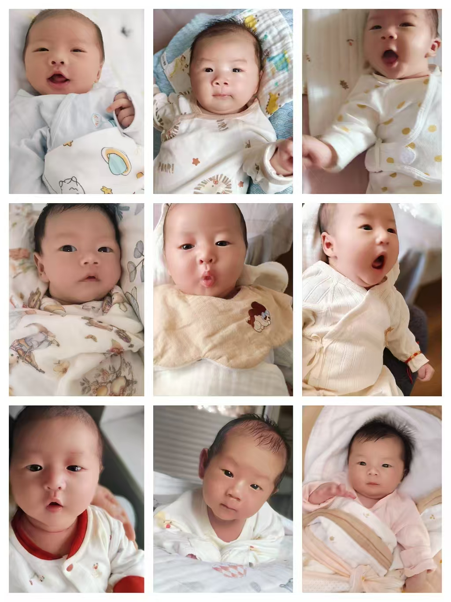

# 黄利凤 - 金牌月嫂在线简历

📱 **手机端优先** · 温馨暖色设计 · 零依赖纯静态

---

## 📂 文件结构

```
月嫂简历/
├── index.html          ← 主页面，改文字内容在这里
├── css/
│   └── style.css       ← 样式文件，改颜色/字体/间距在这里
├── js/
│   └── main.js         ← 交互脚本（灯箱/动画/返回顶部）
├── images/
│   ├── portrait.jpg    ← 个人照片
│   ├── cert-1.jpg      ← 证书1
│   ├── cert-2.jpg      ← 证书2
│   ├── cert-3.jpg      ← 证书3
│   ├── meal-1.jpg      ← 月子餐1
│   ├── meal-2.jpg      ← 月子餐2
│   └── meal-3.jpg      ← 月子餐3
└── README.md           ← 本文件
```

---

## ✏️ 如何编辑

### 修改文字内容
用记事本或任意编辑器打开 `index.html`，搜索你要改的文字，直接修改即可。

关键区域位置：
- **姓名/标签** → 搜索 `黄利凤`
- **个人简介** → 搜索 `二、个人简介` 附近
- **技能** → 搜索 `三、专业核心技能` 附近
- **工作经历** → 搜索 `2019年` 
- **自我评价** → 搜索 `九、自我评价` 附近

### 修改联系方式
打开 `index.html`，搜索 `{{PHONE}}` 和 `{{WECHAT}}`，替换为实际信息：
```html
<!-- 改之前 -->
<strong>{{PHONE}}</strong>

<!-- 改之后 -->
<strong>138-XXXX-XXXX</strong>
```

### 添加/替换照片
1. 把新照片放入 `images/` 文件夹
2. 在 `index.html` 中找到对应位置，改 `src` 属性即可

例如替换个人照片：
```html

```

### 添加宝宝合照
Word文档中的宝宝合照已损坏，如需添加：
1. 在 `index.html` 中搜索 `baby-moments`
2. 删除 `style="display:none;"` 
3. 在 `<div class="gallery gallery--3col" id="babyGallery">` 内添加：
```html
<div class="gallery__item" data-lightbox="baby">
  
</div>
```

### 修改颜色主题
打开 `css/style.css`，修改最顶部的CSS变量：
```css
:root {
  --color-primary: #E8917E;       /* 主色 - 改这里换主题色 */
  --color-bg: #FFF8F5;            /* 背景色 */
  --color-card: #FFFFFF;          /* 卡片背景 */
  --color-accent: #F5C6AA;        /* 强调色 */
  --color-text: #4A3728;          /* 文字色 */
  /* ... */
}
```

---

## 🚀 如何部署

### 方式一：直接打开（本地查看）
双击 `index.html` 即可在浏览器中查看。

### 方式二：部署到 GitHub Pages（免费）
1. 注册 GitHub 账号
2. 新建仓库，上传所有文件
3. Settings → Pages → Source 选 `main` 分支 → Save
4. 获得访问链接：`https://你的用户名.github.io/仓库名`

### 方式三：部署到服务器
将整个文件夹上传到服务器的任意目录即可。

### 方式四：生成二维码
访问 [草料二维码](https://cli.im) → 输入简历网址 → 生成二维码 → 印在名片上。

---

## 🖼️ 图片优化建议

当前照片为原始JPEG，部分文件较大（-2MB），建议优化：
- 使用 [Squoosh](https://squoosh.app/) 在线压缩
- 目标：每张 100-300KB
- 推荐格式：WebP（体积更小）或 JPEG（兼容性更好）
- 尺寸建议：宽度不超过 800px

---

## 📱 微信分享设置

已内置 Open Graph 标签，分享到微信时会显示：
- 标题：黄利凤 - 金牌月嫂个人简历
- 描述：8年经验金牌月嫂 | 持证上岗 | 用心守护母婴健康
- 缩略图：个人照片

如需修改，搜索 `<meta property="og:` 开头的标签。

---

## ⚠️ 注意事项

1. **宝宝照片隐私**：如需展示宝宝合照，建议给宝宝面部打码
2. **联系方式**：部署前记得将 `{{PHONE}}` 和 `{{WECHAT}}` 替换为真实信息
3. **证书照片**：确保照片清晰可读，建议横拍
4. **图片尺寸**：过大图片会影响手机加载速度，建议压缩
